# LED灯的色彩和均匀性检测挑战赛

## 一、赛题分析

#### 1.数据说明

工业自动化质检成为了当下主流与趋势，在整个质检中视觉质检又是重中之重。使用AI的先进视觉技术应用在工业质检领域。基于此，举办了本次比赛， 本次比赛为参赛选手提供了两类数据，良品数据(第一行）和次品数据（第二行）。

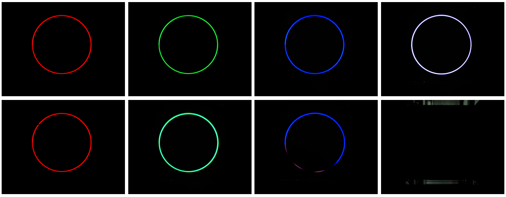

#### 2.赛题分析

本次比赛目的是进行LED灯的色彩和均匀性的自动化质检，具体到本次比赛上就是输入图片，根据图像得出LED灯的色彩和均匀性的良、次两类，故，这是一个二分类任务，如下所示：

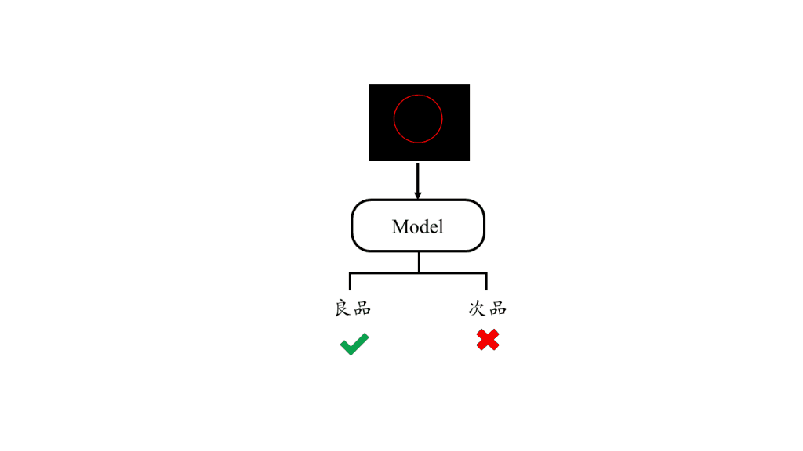

**MMClassification** 是一款基于 PyTorch 的开源图像分类工具箱, **集成了常用的图像分类网络，将数据加载，模型骨架，训练调参，流程等封装为模块调用**，便于在模型间进行转换和比较，也高效简洁的实现了参数调整。

MMClassification 是 [OpenMMLab](https://link.zhihu.com/?target=https%3A//openmmlab.com/) 项目一部分，github主页为： https://github.com/open-mmlab/mmclassification; 文档主页为：https://mmclassification.readthedocs.io/en/latest/


**MMClassification**实现了诸多分类模型，和诸多有用的技巧，代码的质量也十分棒。对于新手而言，只需要简单的修改配置文件，就可以实现模型的更换，训练策略的调整，不同的数据增强手段等。对于进一步学习的人来说，可以在它的基础上后构建自己的模型，学习这个框架的思想等等。

基于此，我下面将根据LED灯的色彩和均匀性检测挑战赛这个任务使用mmclassification进行分类学习，包括：环境的搭建、训练测试流程等。

#### 3.评估

本模型依据提交的结果文件，采用F1-score进行评价。


## 流程

##### 这里我用windows来演示整个流程，Linux相比而言还更方便，更简单一些

#### (1). 检测环境（建议使用GPU环境）

①. 查看GPU环境是否存在，我这里的是GTX1060  显存有6GB

```shell
nvidia-smi
```

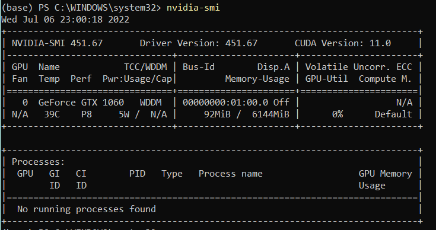

②. 查看CUDA版本

我们注意到，两个命令查询到的CUDA版本号是不一样的，实际上，nvidia-smi是查看支持的最大版本，nvcc --version查看当前服务器安装的版本，因此，真正需要看的nvcc --version这个命令查询的结果（PS: 其实现在使用anaconda可以自动安装cuda）

```shell
nvcc -V/nvcc --verison
```

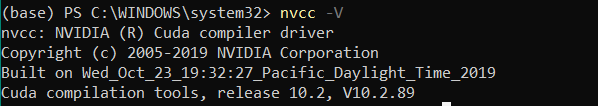

#### (2). 安装Pytorch

①. 根据得到的cuda信息，先创建conda虚拟环境，再根据cuda信息在pytorch 官网: https://pytorch.org/get-started/previous-versions/找到你喜欢的torch版本进行安装

```shell
conda create -n datawhale2022 python=3.8
conda activate -n datawhale2022
conda install pytorch==1.10.0 torchvision==0.11.0 torchaudio==0.10.0 cudatoolkit=10.2 -c pytorch #或者 pip install torch==1.10.0+cu102 torchvision==0.11.0+cu102 torchaudio==0.10.0 -f https://download.pytorch.org/whl/torch_stable.html
```

#### (3). 安装mmcv-full

MMCV 开源框架从属于 OpenMMLab 系列，OpenMMLab 系列是专为计算机视觉不同方向建立统一而开放的代码库。目前已经开源了多个算法框架，例如物体检测的 MMDetection、语义分割的 MMSegmentation 和姿态估计的 MMPose 等等，而 MMCV 是上述一系列上层框架的基础支持库，目前实现的功能也是非常丰富。官方文档如下：https://mmcv.readthedocs.io/zh_CN/latest/get_started/installation.html

MMCV 中涉及到非常多 cuda op，官方提供了两个版本，具体是：

- lite 版本，该版本没有编译 cuda op，也就是说这个版本说明你不需要 cuda op，其他特性完全保留
- full 版本，该版本提前编译了 cuda op，你可以直接下载使用全部特性

lite 版本安装命令是：

```shell
pip install mmcv
```


full 版本安装命令是：以 torch1.10+cuda10.2 为例

```shell
# pip install mmcv-full -f https://download.openmmlab.com/mmcv/dist/{cu_version}/{torch_version}/index.html 
  pip install mmcv-full -f https://download.openmmlab.com/mmcv/dist/cu102/torch1.10.0/index.html 
```

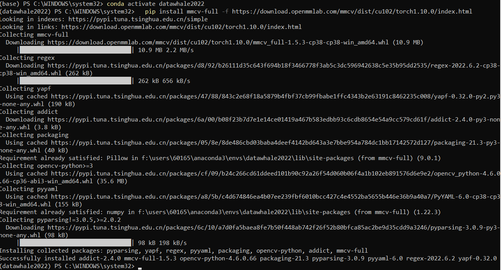

如果需要使用gpu的话，一定要安装**mmcv-full**，而不是mmcv。

安转成功后可以使用https://github.com/open-mmlab/mmcv/blob/master/.dev_scripts/check_installation.py这个脚本检查 mmcv-full 是否安装成功。

#### (4). 安装mmclassification

①. 官方源码本地进行安装，这种方式修改文件更方便，增加一些自定义的东西，推荐**熟手**使用

```python
# install local repo
git clone https://github.com/open-mmlab/mmclassification.git 
cd mmclassification
pip -r install requirements.txt
pip3 install -e .
cd ..
```

②. 使用pip进行安装

```shell
pip install mmcls  # install latest version of mmcls
#or
pip install git+https://github.com/open-mmlab/mmclassification.git # install master branch
```

③. mim 进行安装（官方工具，和openmmlab整个体系兼容，如果你打算还使用openmmlab的其他库的话，推荐学习一下mim）

```shell
# install mim
pip install openmim

# install latest version of mmcls
mim install mmcls
# install master branch
mim install git+https://github.com/open-mmlab/mmclassification.git
# install local repo
git clone https://github.com/open-mmlab/mmclassification.git
cd mmclassification
mim install .

# install extension based on OpenMMLab
mim install git+https://github.com/xxx/mmcls-project.git
```

这里我使用 mim 安装 mmcls作为示例

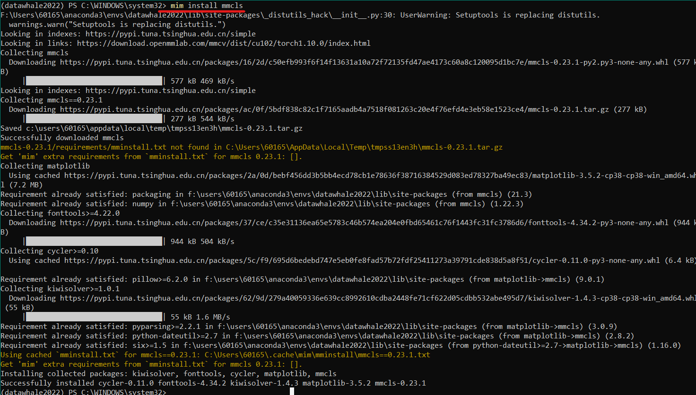

#### (5). 安装Baseline

①. 从github上下载baseline，地址为：https://github.com/bushou-yhh/led_xunfei2022_datawhalechina

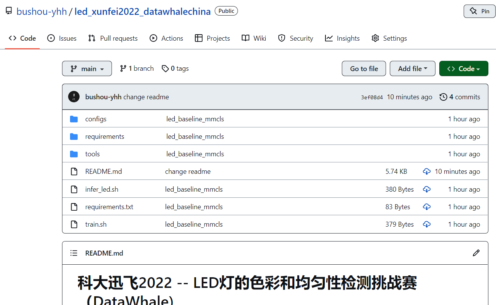

```shell
git clone https://github.com/bushou-yhh/led_xunfei2022_datawhalechina.git
```

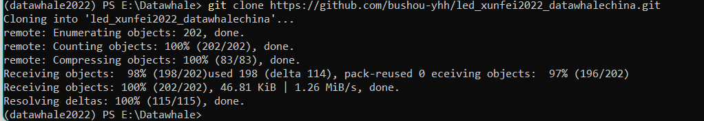

②. 安装依赖包

使用vscode或者pycharm打开led_xunfei2022_datawhalechina，进入后，使用如下命令

```
pip install -r .\requirements.txt
```

包比较多，国内建议对pip和anaconda更换清华源

conda请参考：https://mirrors.tuna.tsinghua.edu.cn/help/anaconda/

pip请参考：https://mirrors.tuna.tsinghua.edu.cn/help/pypi/

③. 下载数据集

1. 百度云（已经处理好的）：

```shell
链接：https://pan.baidu.com/s/1_081H5gdcpdiKdlTn_Lr0g 
提取码：j5yb 
```

2. 官网（需自行处理数据, 请参考readme的文件组织格式）

```
http://challenge.xfyun.cn/topic/info?type=color-and-uniformity&option=stsj
```

修改名称后，使用./tools/datasets_split_led.py对数据进行转换

#### (6). 训练

我已经配置好了这次比赛的部分参数文件（已经配置好的模型包括：hrnet-w18，resnet34， resnet50，swin-tiny），大家可以直接使用，配置文件位于“configs/\_base_/xunfei2022led”目录下：

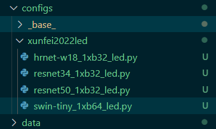

选一个你想尝试的文件，替换掉第一行命令中的CONFIG_FILE, 然后选择一个输出路径替换CONFIG_FILE

```shell
python tools/train.py ${CONFIG_FILE}  --work-dir ${RESULT_DIR}  
```

命令行中输入你修改后的命令，这里我使用的是resnet34作为配置文件，如下所示：

```shell
#for example
python tools/train.py configs/xunfei2022led/resnet34_1xb32_led.py --work-dir training/resnet34_1xb32_led
```

开始训练。。。。。。。(Linux用户也可以直接使用train.sh)

**注意**：如果遇到**“OSError: [WinError 1455] 页面文件太小,无法完成操作”**，请修改“configs/\_base_/datasets"的文件，将文件的workers_per_gpu设置得小一些。 samples_per_gpu这里代表batchsize的大小。

进一步，大家可以参考：①.官方仓库： https://github.com/open-mmlab/mmclassification ②.官方文档： https://mmclassification.readthedocs.io/en/latest/；了解更多的模型，进一步学习使用mmclassification这个工具包，了解常用的一些涨点技巧。

#### (7). 预测

①使用infer.ipynb进行预测

代码如下所示：

```python
from argparse import ArgumentParser
from distutils.command import check
import os
import csv

import mmcv
from os import path as op

from mmcls.apis import inference_model, init_model, show_result_pyplot


img_dir="data/led/test" #图片的路径 
device='cuda:0'  # cuda:0 or cuda:1,2,3...，指定你的gpu
#注意使用模型集成时需考虑config和checkpoint为list
config="configs/xunfei2022led/resnet34_1xb32_led.py" #和training config保持一致，str or list
checkpoint="training/resnet50_1xb32_led/epoch_50.pth" #checkpoint path，模型训练结果的路径 str or list
csv_result="resnet34_1xb32_led.csv" #the path to save csv file，用于保存csv结果的路径
pu_label=False # ture or false，选择是否使用伪标签技巧


# 注意，这里是模型集成的部分代码，假如你要使用模型集成，这里并未完全实现，期待您的实现
if isinstance(config, list) and isinstance(checkpoint, list):  # 这一行代码有误 args.config， args.checkpoint 需要你自行修改
    for config, checkpoint in zip(config, checkpoint):
        models = init_model(config, checkpoint, device=device) 
else:
    # build the model from a config file and a checkpoint file
    models = init_model(config, checkpoint, device=device)    


# write to the csv file
headers = ['image', 'label']
with open(csv_result, 'w+', newline="") as f:
    f_csv = csv.writer(f)
    f_csv.writerow(headers)

    # test  images
    for img in mmcv.track_iter_progress(os.listdir(img_dir)):
        _img = op.join(img_dir, img)
        results = []
        # 当存在多个模型时
        if isinstance(models, list):
            for model in models:
                result = inference_model(model, _img)
                results.append(result)#模型集成，未完成
        else:
            # 当仅为单模型时
            result = inference_model(models, _img)
            
        # 模型集成，伪标签技术（是比赛中常用的很有效的涨点方式），这里我们用pred_score分数去做(PS: 未完整实现，大家如果感兴趣，可以去实现它们)
        pred_label, pred_score, pred_class = result['pred_label'], result['pred_score'], result['pred_class']  
        # write  rows
        
        # 本次比赛为分类问题：这里我们设定一个足够高的阈值, 选择预测概率最有把握的样本的标签作为真实的标签（例如概率为0.99或者概率未0.01的预测标签
        # 将预测然后将得到的有标注的数据加入原始数据继续进行训练，再预测，一直到达停止条件（例如大部分甚至全部unlabeled的样本都被打上了标签），
        # 此时，我们就把未标注的样本通过这种方式标注出来了
        # 这里阈值可以根据实际情况自行设定
        if pu_label == True:
            if pred_score > 0.9:
                row = [img, pred_label]
                f_csv.writerow(row)
        else:
            row = [img, pred_label]
            # import pdb;pdb.set_trace()
            f_csv.writerow(row)

```

②使用tools/infer.py 进行预测

```shell
#for example
python tools/infer.py --img_dir data/led/test --config  configs/xunfei2022led/resnet34_1xb32_led.py   --checkpoint  training/resnet50_1xb32_led/epoch_50.pth --result_csv_file result.csv
```

#### (8). 提交结果

（7）后将得到一个csv文件

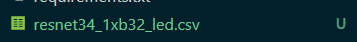

具体格式如下

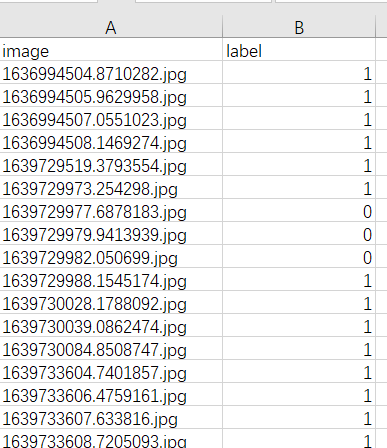

其中，label标签： 0 为良品， 1为次品。

我测试ResNet34(Win11, GTX1060, bs=16, 占用显存1.5G), ResNet50(Ubuntu1804, V100 32G, bs=64), 均使用mmclassification的初始配置，未做任何改动。

ResNet34结果：

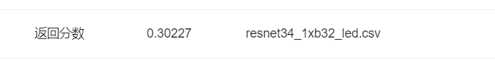

ResNet50结果：

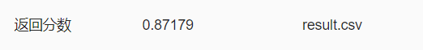

**参考**

> 1. https://zhuanlan.zhihu.com/p/336081587
> 2. https://zhuanlan.zhihu.com/p/441653536
> 3. https://github.com/open-mmlab/mmclassification
> 4. https://mmclassification.readthedocs.io/en/latest/